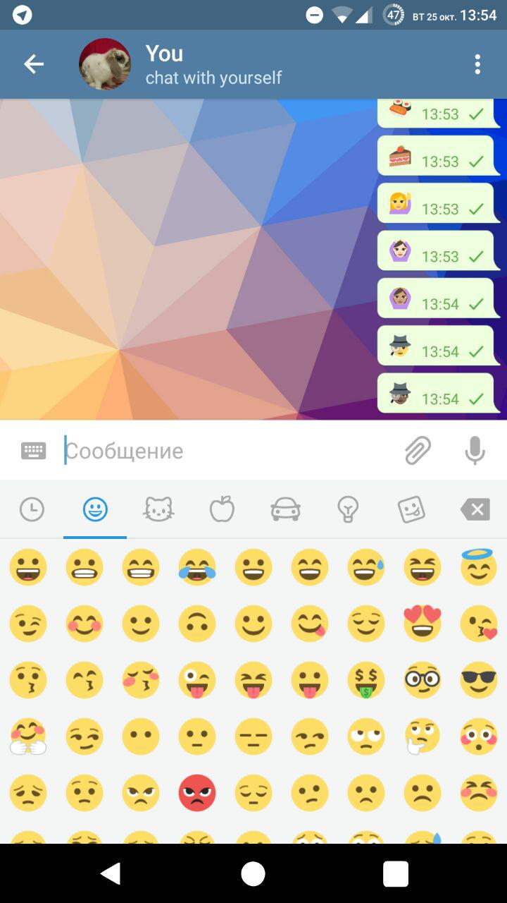

# TelegramReEmoji
Replaces the Apple's emojis in Telegram's official Android client with the ones you choose in module's settings(Google Noto, EmojiOne or Twemoji)

Download from [Xposed Repo](http://repo.xposed.info/module/com.thermatk.android.xf.telegram)

* Emoji art supplied by EmojiOne
* Emoji art supplied by Twitter Twemoji
* Google Emoji font is under the SIL Open Font License, version 1.1.
